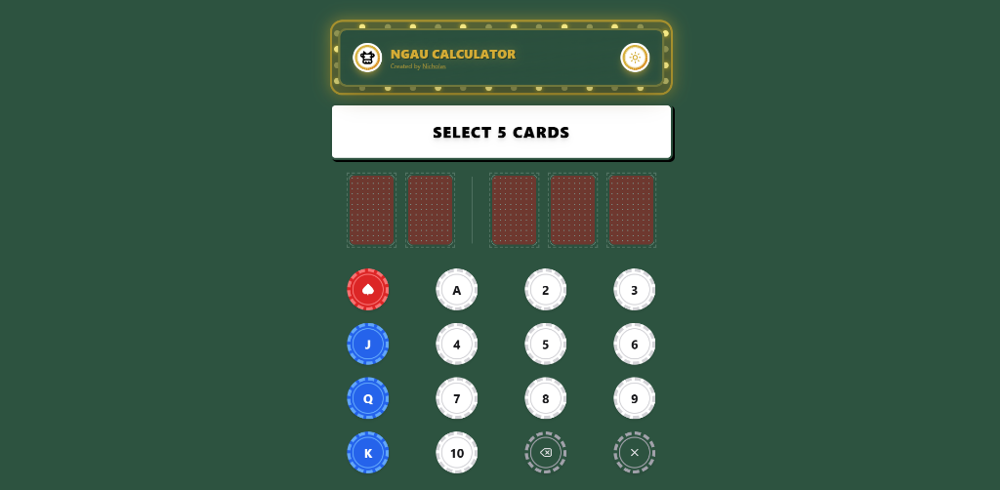
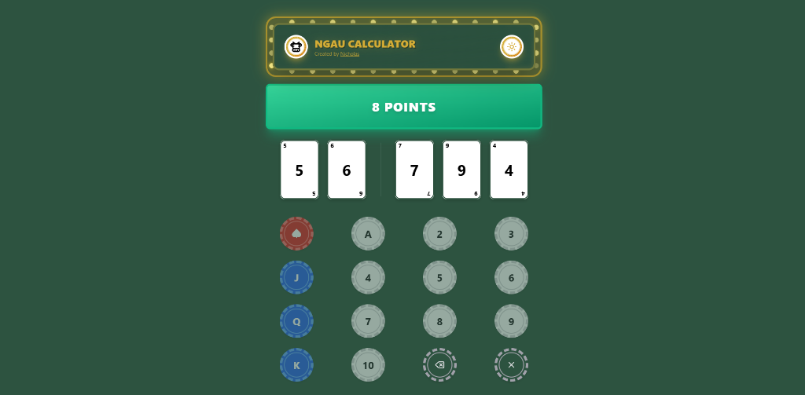
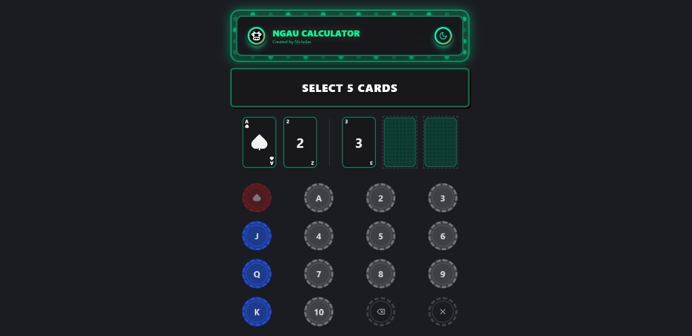
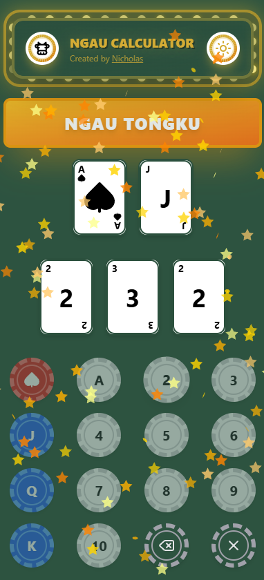

# Ngau Calculator – Unlock Winning Card Combinations with Ease

Tired of losing at Ngau? Want to dominate your friends and family with unbeatable card combinations? The **Ngau Calculator** is your ultimate weapon for mastering the game!

This app unlocks the hidden potential of your hand, showing you the best possible combinations to give you a competitive edge. Built with the power of Next.js and styled with the elegance of Tailwind CSS, Ngau Calculator makes complex calculations effortless, turning your game into a victory parade!

## Desktop View






## Mobile View



## Features

-   **Instant Calculation**: Enter your cards and get the best possible Ngau hand immediately.
-   **Detailed Hand Analysis**: View your hand's score, type (e.g., Ngau Tongku, Pair, Normal), and points.
-   **Poker-Themed UI**: Experience a premium feel with a green felt background, red card backs, and poker chip aesthetics.
-   **Dark Mode Support**: Seamlessly switch between light and dark themes for comfortable viewing in any lighting.
-   **Interactive Animations**: Enjoy celebratory confetti effects for winning "Ngau Tongku" hands.
-   **Responsive Design**: Optimized for both desktop and mobile devices.

## Usage

The Ngau Calculator helps you determine the best possible hand in the card game Ngau. Ngau involves making combinations of cards to achieve the highest possible score. The calculator takes five cards as input and outputs the best combination of "bull" (a group of three cards that sum to a multiple of 10) and the remaining two cards.

### How to Use

1.  **Select five cards** from the poker chip buttons:
    -   ♠️: Ace of Spades (special card)
    -   **A**: Any other Ace (Hearts, Diamonds, or Clubs)
    -   **J, Q, K**: Face cards (Jack, Queen, King)
    -   **2-10**: Number cards
2.  The calculator **automatically calculates** the best hand as soon as you select the fifth card.
3.  The result displays:
    -   **Hand type**: Ngau Tongku (best), Pair, or Normal
    -   **Points**: The score of your hand (0-10 points)
4.  Use the **Delete** button to remove the last card or **Clear All** to start over.

## Getting Started

### Prerequisites

Before you can run the Ngau Calculator locally, make sure you have the following installed:

-   Node.js (>=18)
-   npm or yarn

### Installation

Follow these steps to get the Ngau Calculator up and running:

1.  Clone the repository:

    ```bash
    git clone https://github.com/nicholaslhq/ngau-calculator.git
    ```

2.  Navigate to the project directory:

    ```bash
    cd ngau-calculator
    ```

3.  Install dependencies:

    ```bash
    npm install
    # or
    yarn install
    ```

4.  Run the development server:

    ```bash
    npm run dev
    # or
    yarn dev
    ```

Open [http://localhost:3000](http://localhost:3000) with your browser to see the result.

## Architecture

The project is structured as follows:

-   `src/app/page.tsx`: Main page component, responsible for rendering the calculator UI.
-   `src/components/NgauCalculator.tsx`: The main calculator component, handling user input and displaying the results.
-   `src/lib/calculator.ts`: Contains the core logic for calculating the best Ngau combination.
-   `src/components/ui/`: Reusable UI components built with **Shadcn UI**.

**Tech Stack:**

-   **Framework**: Next.js 15
-   **Styling**: Tailwind CSS
-   **UI Components**: Shadcn UI
-   **Icons**: Lucide React
-   **Animations**: Canvas Confetti, Tailwindcss Animate

For technical users:

The `src/lib/calculator.ts` file implements the following algorithm:

1.  **Combination Generation:** It generates all possible combinations of three cards from the hand of five cards using a recursive generator function.
2.  **Bull Validation:** For each combination, it checks if the sum of the three cards is a multiple of 10 (a valid "bull"). This involves mapping each card to its possible numerical values (e.g., 'A' to 1, 'J', 'Q', 'K' to 10).
3.  **Score Calculation:** If a valid "bull" is found, it calculates the score of the remaining two cards based on their combination (Ngau, Double, or Normal).
4.  **Best Hand Determination:** The calculator then determines the best combination based on a ranking system (Ngau > Double > Normal) and the points associated with each hand.

## Contributing

Contributions are welcome! Please follow these guidelines:

1.  Fork the repository.
2.  Create a new branch for your feature or bug fix.
3.  Write tests for your code.
4.  Submit a pull request.

### Code Style

Use Prettier to format your code.

### Testing

Run tests with `npm test`.

## License

This project is licensed under the MIT License - see the [LICENSE](LICENSE) file for details.

## Roadmap

Here are some future improvements and features planned for the Ngau Calculator:

-   **PWA Support**: Install the app on your device for offline access.
-   **Sound Effects**: Add audio feedback for card interactions and winning hands.
-   **Hand History**: Keep a log of your past calculations.
-   **Multi-language Support**: Translate the interface into multiple languages.
-   **Multiple Card Decks**: Support for different card designs and deck styles.

## Credits

This project was developed and is maintained solely by [Nicholas Lee](https://github.com/nicholaslhq). All aspects of the design, development, and implementation have been carried out independently.

Special thanks to:

-   **[ChatGPT](https://chatgpt.com/)**: For providing assistance and guidance throughout the development process.
-   **Antigravity**: For being an awesome pair programmer and helping with the implementation.

If you have any questions, feedback, or suggestions, please raise an issue on the [GitHub repository](https://github.com/nicholaslhq/ngau-calculator/issues). I welcome any input and will do my best to address your concerns.

Thank you for checking out the Ngau Calculator!
